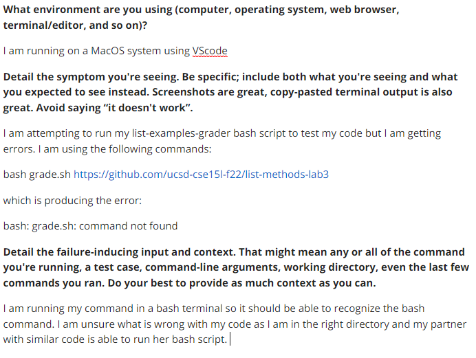

# Origional Student Post
1. The student is attempting to run their bash script for the list-examples-grader code which takes an input in the form of a path to a student submission. 


# TA response to the Post
2. This debug post was through and included the failure inducing commands as well as the error output. Although screenshot might have been more clear, the student followed the debug prompts and therefore the TA could effectively help with debugging as the problem was clearly outlined.


3. The setup of this grader includes a grader server a server and a bash script that checks certain atributes about a given path to a student submission such as if the file exists, whether it compiles, whether it has the intended implementation, etc. The bug was in the way in which the bash script was being run and therefore the file contents remained the same before and after fixing the bug. The command that produced the bug: 	```grade.sh https://github.com/ucsd-cse15l-f22/list-methods-lab3```, the coder assumed that running this command in a bash terminal meant that the keyword bash could be left out of the command but the correct command is as follows: 	```bash grade.sh https://github.com/ucsd-cse15l-f22/list-methods-lab3```
4. After running the correct code, the students output look was as follows: 

